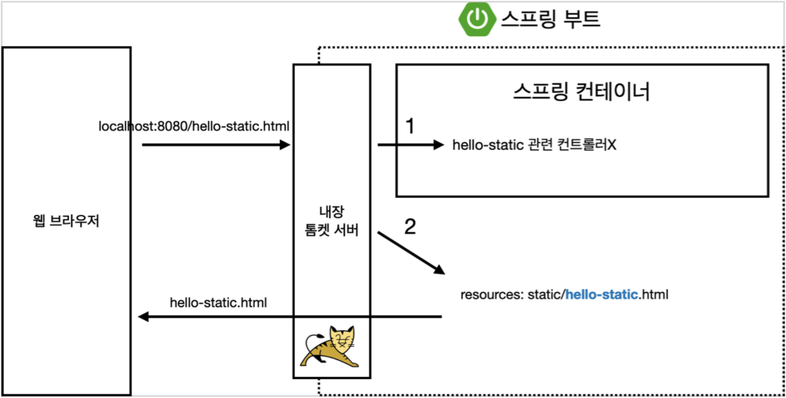
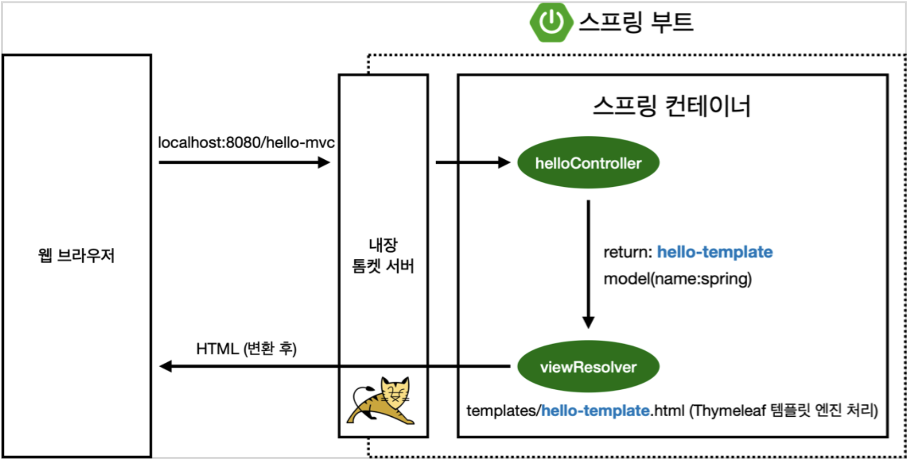
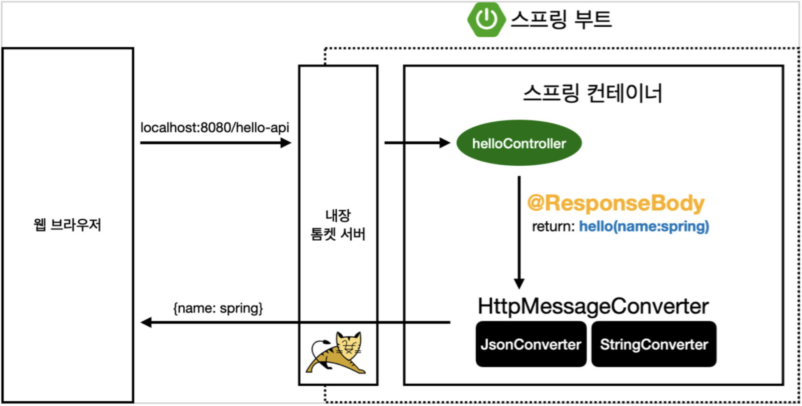
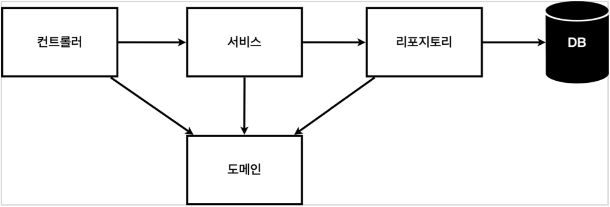
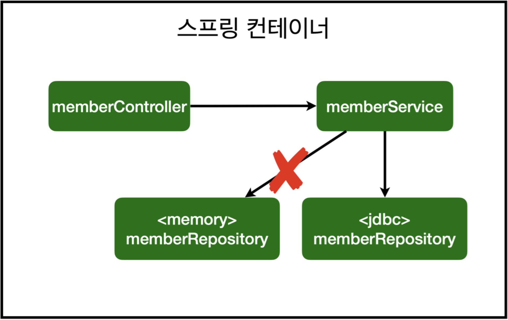

# 스프링 입문 - 코드로 배우는 스프링 부트, 웹 MVC, DB 접근 기술
## 프로젝트 환경설정
### 라이브러리 살펴보기
- Gradle, Maven 등의 툴이 라이브러리 간 의존관계를 자동으로 관리해준다.
### Welcome Page 만들기
- Spring Boot supports both static and templated welcome pages. It first looks for an `index.html` file in the configured static content locations. If one is not found, it then looks for an `index` template. If either is found, it is automatically used as the welcome page of the application.

## 스프링 웹 개발 기초
### 정적 컨텐츠
 
- 스프링 컨테이너 안에 hello-static 관련 컨트롤러가 존재하지 않으면 `resources:static/hello-static.html`을 찾아 화면을 렌더링한다.
### MVC와 템플릿 엔진
 
- 컨트롤러에서 리턴 값으로 문자(viewName)를 반환하면 `viewResolver`가 `resource:templates/viewName.html`을 찾아 템플릿 엔진 처리를 통해 화면을 렌더링한다.
### API
 
- `@Responsebody`를 사용하면 `viewResolver`를 사용하지 않고, `HttpMessageConverter`가 동작하여 HTTP의 Body에 문자 내용을 직접 반환한다.
- 기본 문자 처리는 `StringHttpMessageConverter`가, 기본 객체 처리는 `MappingJackson2HttpMessageConverter`가 담당한다.
- 클라이언트의 HTTP Accept Header와 서버의 컨트롤러 반환 타입 정보를 조합하여 `HttpMessageConverter`가 선택된다.

## 회원 관리 예제 - 백엔드 개발
### 일반적인 웹 애플리케이션 계층 구조
 
- Controller: 웹 MVC의 컨트롤러 역할
- Service: 핵심 비즈니스 로직
- Repository: 데이터베이스에 접근, 도메인 객체를 DB에 저장하고 관리
- Domain: 비즈니스 도메인 객체 (ex. 회원, 주문, 쿠폰 등)

## 스프링 빈과 의존관계
### 컴포넌트 스캔과 자동 의존관계 설정
- `@Component` 어노테이션이 있으면 스프링 빈으로 자동 등록된다.
- `@Component`를 포함하는 `@Controller`, `@Service`, `@Repository`도 스프링 빈으로 자동 등록된다. 
- DI(Dependency Injection): 생성자에 `@Autowired`가 있으면 스프링이 연관된 객체를 스프링 컨테이너에서 찾아서 넣어준다. 이때 생성자가 한 개만 있는 경우에는 `@Autowired`를 생략할 수 있다.
- 스프링은 스프링 컨테이너에 스프링 빈을 등록할 때 기본적으로 싱글톤으로 등록한다. 따라서 같은 스프링 빈이면 모두 같은 인스턴스이다. 싱글톤이 아니게 설정할 수 있지만, 특별한 경우를 제외하면 대부분 싱글톤을 사용한다.
- DI에는 Field Injection, Setter Injection, Constructor Injection의 세 가지 방식이 있다.
  - Field Injection: 변경의 여지가 없으므로 비추
  - Setter Injection: Setter를 `public`으로 열어둬야 하므로 비추
### 자바 코드로 직접 스프링 빈 등록하기
- 실무에서는 주로 정형화된 Controller, Service, Repository 같은 코드는 컴포넌트 스캔을 사용한다.
- 정형화되지 않거나 상황에 따라 구현 클래스를 변경해야 하는 경우에는 설정을 통해 스프링 빈으로 등록한다.
- `@Autowired`를 통한 DI는 스프링이 관리하는 객체에서만 동작한다. 스프링 빈으로 등록하지 않고 직접 생성한 객체에서는 동작하지 않는다. (ex. `java/demo/Demo.class`에서 동작 X)

## 스프링 DB 접근 기술
 
- OCP(Open-Closed Principle): 스프링의 DI를 사용하면 기존 코드를 전혀 손대지 않고, 설정만으로 구현 클래스를 변경할 수 있다.
### 순수 JDBC
- Java는 DB와 연동하기 위해서 JDBC 드라이버가 필요하다.
- `DataSource`는 DB Connection을 획득할 때 사용하는 객체이다. 스프링 부트가 DB Connection 정보를 바탕으로 `DataSource`를 생성하고 스프링 빈으로 등록해두기 때문에 DI 받을 수 있다.
### 스프링 통합 테스트
- `@SpringBootTest` 어노테이션이 있으면 스프링 컨테이너와 테스트를 함께 실행한다.
- 테스트 케이스에 `@Transactional` 어노테이션이 있으면 테스트 시작 전에 트랜잭션을 시작하고, 테스트 완료 후에 항상 롤백한다. 이렇게 하면 DB에 데이터가 남지 않으므로 다음 테스트에 영향을 주지 않는다. 
- Unit Test가 좋은 테스트이므로 가급적 Unit Test를 사용하는 것이 좋다.
### JPA
- JPA는 표준 인터페이스이고, 이를 구현한 것 중 대표적인 것이 Hibernate이다.
- JPA는 ORM(Object Relational Mapping) 기술로, 객체와 RDBMS를 연결한다.
- `build.gradle`
  - `spring-boot-starter-data-jpa`는 내부에 JDBC 관련 라이브러리를 포함하므로 별도로 JDBC 관련 라이브러리를 추가할 필요가 없다.
- `resources/application.properties`
  - `spring.jpa.show-sql`: JPA가 생성하는 SQL을 출력할지 여부 설정
  - `spring.jpa.hibernate.ddl-auto`: 엔티티 정보를 바탕으로 테이블을 자동 생성할지 여부 설정
- JPA를 통한 모든 데이터 변경은 트랜잭션 안에서 실행해야 한다. 스프링은 `@Transactional` 어노테이션이 있는 클래스의 메서드를 실행할 때 트랜잭션을 시작하고, 메서드가 정상 종료되면 트랜잭션을 커밋, 런타임 예외가 발생하면 롤백한다.
### 스프링 데이터 JPA
- `findBy~()`와 같은 형태로 메서드명을 작성하면 스프링 데이터 JPA가 `SELECT m FROM Member m WHERE m.~ = ?`와 같은 JPQL을 작성해준다.